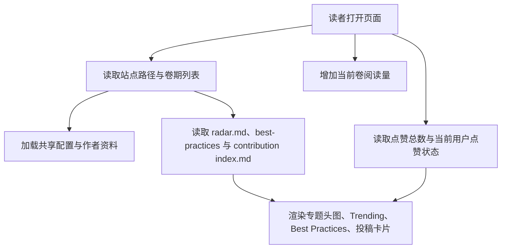
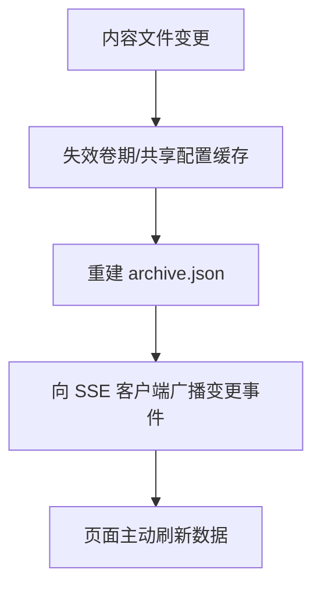
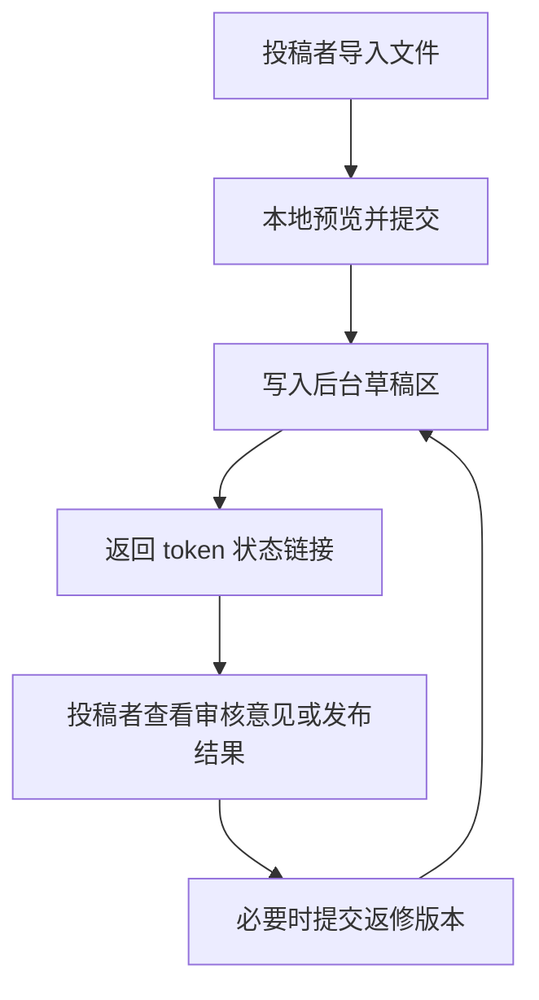
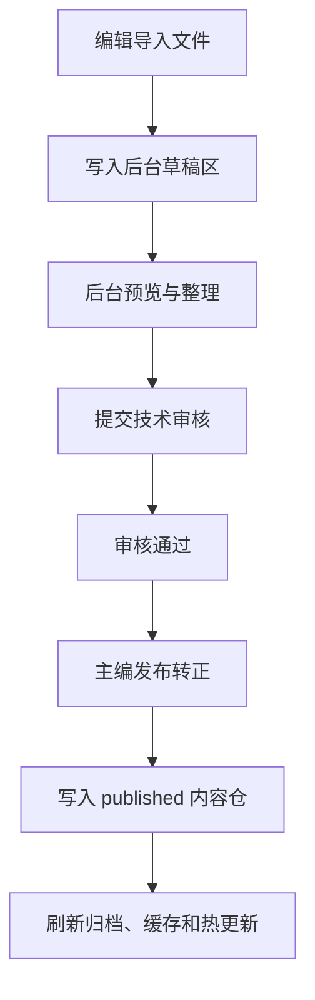

# 系统概览

## 系统职责

项目提供“技术周刊单页阅读体验”，对外承诺以下能力：

1. 基于内容目录加载已发布期刊与草稿期刊。
2. 以统一入口页呈现专题信息、Trending 条目、Best Practices、投稿内容、统计面板与检索结果。
3. 对文章点赞、对期刊计数阅读量，并将运行时数据持久化到内容目录。
4. 在内容变更时失效缓存、刷新归档清单，并向已连接页面发送热更新事件。
5. 为投稿者提供自助投稿、预览、状态查询与返修入口。
6. 为内网编辑团队提供后台管理入口，支持草稿导入、投稿接收、预览、审核、作者维护、发布转正和已发布内容治理。

## 模块职责

| 模块 | 唯一职责 | 对外依赖 | 对外输出 |
|------|----------|----------|----------|
| 页面壳层 | 组织当前期内容、归档导航、Best Practices、投稿列表、统计弹窗、搜索交互与图片导出 | HTTP 接口、静态 Markdown/图片资源、浏览器保存能力 | 用户可见页面、交互事件与导出图片 |
| 内容接口层 | 将内容目录转换为稳定的读取/交互接口 | 内容仓、运行时数据仓 | 配置、作者、卷期、投稿、统计、搜索、点赞、阅读量、热更新流 |
| 内容仓 | 存储发布内容、草稿内容、共享配置与静态资源 | 编辑侧写入的文件结构 | 可被页面和接口层消费的 Markdown/资产 |
| 运行时数据仓 | 存储点赞数、阅读量、点赞身份映射 | 接口层写入 | 可恢复的用户交互统计 |
| 后台管理界面 | 管理后台登录、草稿、审核、作者与发布操作 | 后台 API、浏览器文件导入能力 | 操作者可见的工作台、表单、预览和发布操作 |
| 投稿者入口 | 提供文件导入、Markdown 预览、作者绑定、状态查询和返修 | 投稿 API、浏览器文件导入能力 | 投稿草稿、状态链接、投稿者可见反馈 |
| 后台内容写入层 | 将投稿者和后台操作转换为受控文件写入 | 后台私有数据仓、内容仓、作者主数据 | 草稿、审核记录、作者更新、审计日志和发布后的正式投稿 |
| 热更新通道 | 广播内容变更事件 | 文件变更事件 | SSE 消息流 |

## 关键数据流

## 主流程契约

### 读一期周刊

`卷期选择 -> 读取专题内容 -> 读取 Best Practices/投稿目录 -> 拉取点赞/阅读统计 -> 渲染页面`

稳定承诺：

- 页面依赖卷期列表与内容目录，而不是硬编码某一期。
- `radar.md` 不存在时，Trending 区块可隐藏，但页面仍可继续浏览投稿。
- `best-practices/` 不存在或为空时，对应区块可隐藏，但页面仍可继续浏览其它内容。
- `contributions/` 不存在或为空时，投稿区块可隐藏，但页面仍可继续浏览专题内容。

### 点赞交互

`articleId + 客户端身份 -> 切换点赞状态 -> 返回最新 likes 与 userLiked`

稳定承诺：

- 同一客户端对同一文章在任一时刻最多记为 1 次点赞。
- 返回结果必须同时包含最新计数与当前用户状态，避免前端推断。
- 点赞计数与身份映射在持久化后必须一致。

### 热更新

`内容变更 -> 失效缓存 -> 生成归档 -> 广播事件`

稳定承诺：

- 仅当内容或共享配置变化时触发刷新语义。
- 客户端只依赖“发生变更”这一事实，不依赖具体实现方式。

### 图片导出

`当前卷期页面 -> 临时收起可展开内容 -> 生成 PNG -> 交给浏览器保存/下载`

稳定承诺：

- 导出对象是当前卷期的主阅读内容，不包含侧边导航、投稿入口或导出按钮本身。
- 导出格式为 PNG，默认文件名遵循 `tech-radar-vol-<vol>.png`。
- 导出过程不改变内容数据、点赞状态或阅读量。
- 若浏览器保存或图片生成失败，页面必须恢复到可继续操作状态，并给出失败反馈。

### 后台发布

`导入草稿 -> 编辑整理 -> 技术审核 -> 主编发布 -> 读者页热更新`

稳定承诺：

- 后台操作者与内容作者分离；后台权限不能从文章作者身份推导。
- 后台草稿允许临时作者；已发布内容必须引用正式作者主数据。
- 发布转正只能由主编执行，且目标路径冲突时必须拒绝。
- 后台私有数据不对浏览器公开，只能通过后台 API 访问。

### 投稿闭环

`投稿者提交 -> 编辑接收 -> 技术审核退回/通过 -> 投稿者返修或主编发布`

稳定承诺：

- 投稿者通过 token 链接访问自己的投稿，不进入后台权限体系。
- 投稿草稿和后台导入草稿统一存放在 `contents/admin/drafts/`。
- 投稿返修会增加 revision，并保留审核历史。
- 发布后投稿者状态链接可看到正式文章标识。

### 已发布内容治理

`编辑修改已发布内容 -> 内容检查 -> 读者页更新`；`主编下线/恢复 -> 归档与缓存刷新`

稳定承诺：

- 已发布内容修改必须继续满足正式内容契约。
- 下线文章不硬删除，移动到后台私有归档。
- 下线文章不参与读者 API、搜索或统计；恢复后重新可见。

## 依赖边界

| 边界 | 允许依赖 | 不允许依赖 |
|------|----------|------------|
| 页面壳层 -> 内容接口层 | HTTP/SSE/静态资源路径 | 运行时 JSON 文件内部格式、服务端锁/缓存实现 |
| 内容接口层 -> 内容仓 | 目录结构、Markdown frontmatter 契约、资源相对路径 | 页面 DOM 结构、具体展示语言 |
| 后台管理界面 -> 后台内容写入层 | `/api/admin/**`、登录会话、后台权限字段 | 内容仓本地绝对路径、密码摘要格式 |
| 投稿者入口 -> 后台内容写入层 | `/api/submissions/**`、submission token | 后台登录会话、后台私有路径、token 摘要 |
| 后台内容写入层 -> 内容仓 | 内容契约、作者主数据、草稿状态机 | 读者页 DOM 结构、前端局部状态 |
| 运行时数据仓 -> 页面壳层 | 聚合后的 API 输出 | 前端局部状态或按钮样式 |

## 公开资源边界

- 公开资源仅包括入口页、`/assets/**` 和受控的 `/contents/published/**`、`/contents/draft/**`、`/contents/shared/**`、`/contents/assets/**`。
- `contents/data/` 属于运行时私有数据仓，不对浏览器公开。
- `contents/admin/` 属于后台私有数据仓，不对浏览器公开。
- 客户端只能通过 API 读取统计与点赞状态，不能直接依赖底层存储文件。

## 多语言约束

- 标题、徽章名、作者信息、页脚等文案属于内容或配置输入，不属于代码常量契约。
- 测试应校验结构、可用性与关联关系，不应锁死中文或英文具体文案。
- 后续若引入显式语言切换，优先在内容与配置层扩展字段，而不是在页面逻辑中硬编码语言分支。
